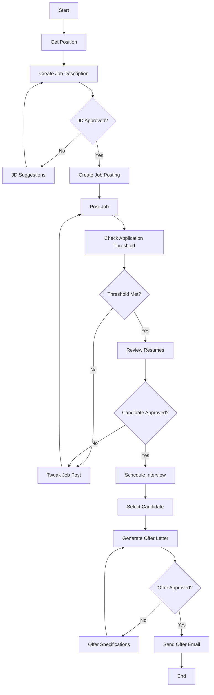

# 🤖 HR Recruiting Agent

An intelligent, AI-powered HR recruiting system that automates the entire hiring workflow from job description creation to offer letter generation using LangGraph, Cerebras AI, and advanced RAG (Retrieval-Augmented Generation) technology for Reviewing Resume. We are using LangSmith for monitoring whole flow

## 🌟 Live Demo

- **HR Agent**: [https://hrrecruitingagent-production.up.railway.app/](https://hrrecruitingagent-production.up.railway.app/)
- **LinkedIn Clone**: [https://linkedinclone-c6939.web.app/](https://linkedinclone-c6939.web.app/)

## 🎯 Overview

The HR Recruiting Agent is a comprehensive solution that streamlines the hiring process through intelligent automation. It combines the power of LangGraph for workflow orchestration, Cerebras AI for natural language processing, and advanced RAG systems for candidate matching.

### Key Features

- 🤖 **Automated Workflow**: Complete end-to-end hiring process automation
- 📝 **AI-Generated Job Descriptions**: Intelligent JD creation with company context
- 🔍 **Smart Resume Analysis**: RAG-powered candidate matching and evaluation
- 📧 **Automated Email Communication**: AI-driven email generation and sending
- 🎯 **Human-in-the-Loop**: Strategic intervention points for human oversight
- 📊 **Real-time Monitoring**: Live workflow tracking and status updates using LangSmith
- 🌐 **Modern Web Interface**: Streamlit-based intuitive user interface

## 🏗️ System Architecture

### Core Components

```
HRRecruitingAgent/
├── app.py                          # Main Streamlit application
├── HrAssistantAgent/
│   ├── graphUtil.py               # LangGraph workflow orchestration
│   ├── llm_rag.py                 # RAG pipeline for resume analysis
│   ├── llmUtils.py                # Cerebras AI utilities
│   └── dbModels/                  # Database models
│       ├── job_model.py           # Job data structure
│       └── application_model.py   # Application data structure
├── linkedin_clone/                # Angular frontend application
└── requirements.txt               # Python dependencies
```

### Technology Stack

- **Backend**: Python, Streamlit, LangGraph, LangChain
- **AI/ML**: Cerebras AI,llama-3.3-70b, llama-4-scout-17b-16e-instruct, OpenAI GPT-4, FAISS vector database
- **Database**: Supabase (PostgreSQL)
- **Frontend**: Angular, TypeScript, Firebase Hosting
- **Deployment**: Railway, Docker, Docker Compose

## 🔄 HR Workflow Process

The system implements a sophisticated workflow using LangGraph with the following stages:

### 1. Job Description Creation
- **Input**: Position title
- **Process**: AI generates comprehensive job description using company context
- **Output**: Structured job description with requirements and responsibilities
- **Human Intervention**: Approval/rejection with feedback loop

### 2. Job Posting
- **Process**: Converts JD to structured job posting data
- **Database**: Stores job in Supabase
- **Monitoring**: Tracks application threshold (minimum 5 applications)

### 3. Resume Analysis & Candidate Selection
- **RAG Pipeline**: Downloads and processes candidate resumes
- **Vector Search**: Uses FAISS for semantic similarity matching
- **AI Evaluation**: Cerebras AI analyzes candidates against job requirements using RAG based flows
- **Output**: Ranked candidate summary with contact information

### 4. Interview & Selection
- **Human Decision**: HR approval for candidate selection
- **Interview Scheduling**: Automated interview coordination
- **Final Selection**: Candidate confirmation

### 5. Offer Letter Generation
- **AI Generation**: Creates personalized offer letters
- **Customization**: Incorporates salary, benefits, and position details
- **Approval Process**: Human review and approval

### 6. Email Communication
- **Automated Emails**: AI-generated professional communication
- **SMTP Integration**: Gmail-based email delivery
- **Tracking**: Email status monitoring

## 🚀 Quick Start

### Prerequisites

- Python 3.9+
- Node.js 16+ (for frontend)
- Docker (optional)
- Cerebras API key
- Gmail credentials for email functionality

### Installation

1. **Clone the repository**
   ```bash
   git clone https://github.com/yourusername/HRRecruitingAgent.git
   cd HRRecruitingAgent
   ```

2. **Install Python dependencies**
   ```bash
   pip install -r requirements.txt
   ```

3. **Set up environment variables**
   ```bash
   # Create .env file
   echo "EMAIL_USER=your-email@gmail.com" >> .env
   echo "EMAIL_PASSWORD=your-app-password" >> .env
   echo "CEREBRAS_API_KEY=your-cerebras-api-key" >> .env
   ```

4. **Run the application**
   ```bash
   streamlit run app.py
   ```

5. **Access the application**
   - Open your browser to `http://localhost:8501`

### Docker Deployment

1. **Build the Docker image**
   ```bash
   docker build -t hr-recruiting-agent .
   ```

2. **Run with Docker Compose**
   ```bash
   docker-compose up -d
   ```

## 📊 Workflow Graph

The system uses LangGraph to orchestrate the hiring workflow with intelligent routing and human intervention points:



## 🔧 Configuration

### Environment Variables

| Variable | Description | Required |
|----------|-------------|----------|
| `EMAIL_USER` | Gmail address for sending emails | Yes |
| `EMAIL_PASSWORD` | Gmail app password | Yes |
| `CEREBRAS_API_KEY` | Cerebras AI API key | Yes |

### Database Configuration

The system uses Supabase for data persistence:

- **Jobs Table**: Stores job postings and metadata
- **Applications Table**: Manages candidate applications and resume URLs
- **Vector Storage**: FAISS index for resume similarity search

## 🎨 Frontend Application

The LinkedIn Clone frontend provides a modern interface for job browsing and applications:

### Features
- **Job Listings**: Browse available positions
- **Application System**: Submit applications with resume upload
- **Responsive Design**: Mobile-friendly interface
- **Real-time Updates**: Live job posting updates

### Setup
```bash
cd linkedin_clone
npm install
ng serve
```

## 📈 Performance & Scalability

### Optimization Features
- **Vector Caching**: FAISS index persistence for fast resume matching
- **Async Processing**: Non-blocking workflow execution
- **Memory Management**: Efficient document processing and cleanup
- **Error Handling**: Robust error recovery and logging

### Monitoring
- **Workflow Tracking**: Real-time status updates
- **Performance Metrics**: Processing time and success rates
- **Error Logging**: Comprehensive error tracking and debugging

## 🔒 Security & Privacy

### Data Protection
- **Environment Variables**: Secure credential management
- **Database Security**: Supabase row-level security
- **File Cleanup**: Automatic temporary file removal
- **Email Security**: SMTP with TLS encryption

### Compliance
- **GDPR Ready**: Data processing transparency
- **Audit Trail**: Complete workflow logging
- **Access Control**: Role-based permissions (extensible)

## 🚀 Deployment Options

### Railway (Recommended)
```bash
# Automatic deployment via GitHub integration
# Set environment variables in Railway dashboard
```

### Render
```bash
# Connect GitHub repository
# Configure build and start commands
# Set environment variables
```

### Docker
```bash
docker run -p 8501:8501 \
  -e EMAIL_USER=your-email@gmail.com \
  -e EMAIL_PASSWORD=your-app-password \
  -e CEREBRAS_API_KEY=your-api-key \
  hr-recruiting-agent
```

## 🧪 Testing

### Unit Tests
```bash
# Run Python tests
python -m pytest tests/

# Run Angular tests
cd linkedin_clone
ng test
```

### Integration Tests
```bash
# Test workflow end-to-end
python test_workflow.py
```

## 📚 API Documentation

### Core Functions

#### `HRRecruitingGraph`
Main workflow orchestration class with the following key methods:

- `create_job_description(position)`: Generate AI-powered job description
- `review_resume(job_id)`: Analyze candidates using RAG pipeline
- `generate_offer_letter(candidate, position, details)`: Create personalized offer letters
- `send_mail(subject, body, receiver)`: Automated email communication

#### `PDFRAGPipeline`
Resume analysis and candidate matching:

- `download_pdfs(resume_list)`: Download candidate resumes
- `build_faiss_index(documents)`: Create vector search index
- `query(jd, top_k)`: Find best matching candidates

## 🤝 Contributing

1. Fork the repository
2. Create a feature branch (`git checkout -b feature/amazing-feature`)
3. Commit your changes (`git commit -m 'Add amazing feature'`)
4. Push to the branch (`git push origin feature/amazing-feature`)
5. Open a Pull Request

### Development Guidelines
- Follow PEP 8 for Python code
- Use TypeScript for Angular components
- Add tests for new features
- Update documentation for API changes

## 📄 License

This project is licensed under the MIT License - see the [LICENSE](LICENSE) file for details.

## 🙏 Acknowledgments

- **Cerebras Systems** for providing advanced AI infrastructure
- **LangChain** for the powerful LLM framework
- **Supabase** for the backend-as-a-service platform
- **Streamlit** for the intuitive web interface

## 📞 Support

For support and questions:
- Create an issue in the GitHub repository
- Check the [documentation](docs/)
- Review the [troubleshooting guide](DEPLOYMENT.md#troubleshooting)

## 🔮 Roadmap

### Upcoming Features
- [ ] Multi-language support
- [ ] Advanced analytics dashboard
- [ ] Integration with popular ATS systems
- [ ] Mobile application
- [ ] Advanced candidate scoring algorithms
- [ ] Video interview scheduling
- [ ] Background check integration

### Performance Improvements
- [ ] Distributed processing for large resume volumes
- [ ] Advanced caching strategies
- [ ] Real-time collaboration features
- [ ] Enhanced error recovery mechanisms

---

**Built with ❤️ using Cerebras AI, LangGraph, and modern web technologies**